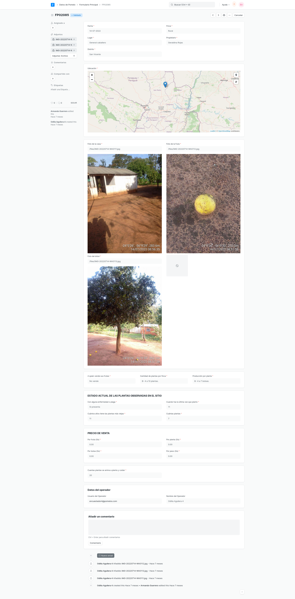
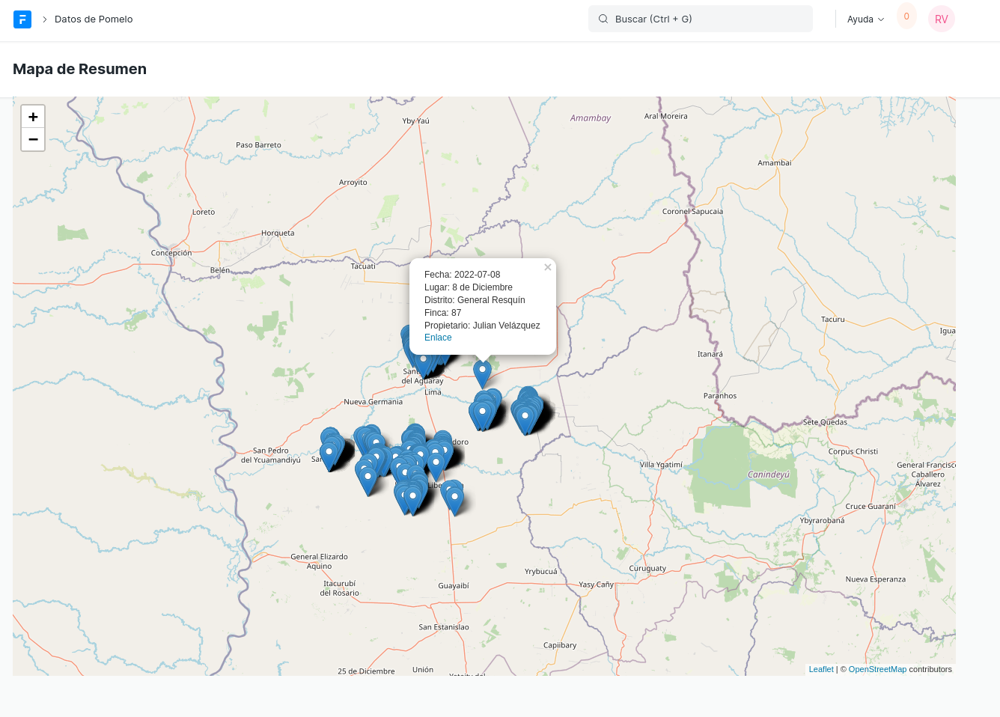

## Armando App

Simple custom Frappe App with a form to capture data about rural properties and show them in a map.

## What is this app for?

This app consists basically of two parts:

### 1. A form for make the survey

### 2. A Georeferenced map to for all the locations the survey was phisically made

#### License

MIT